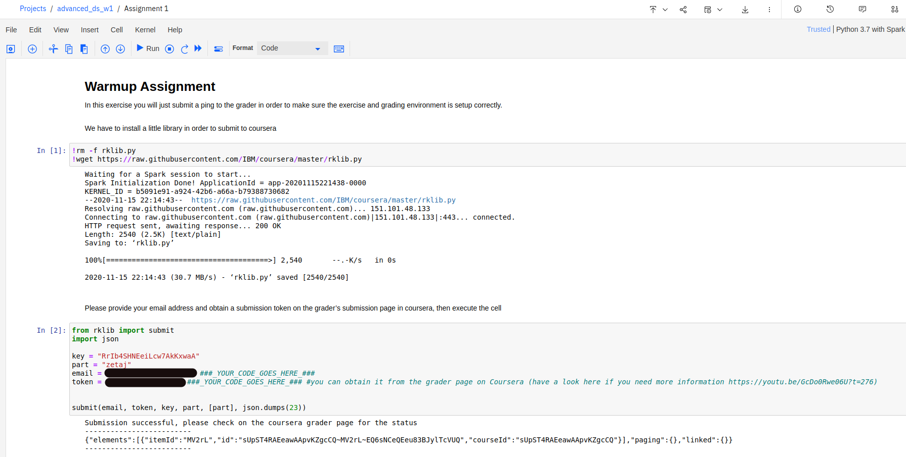
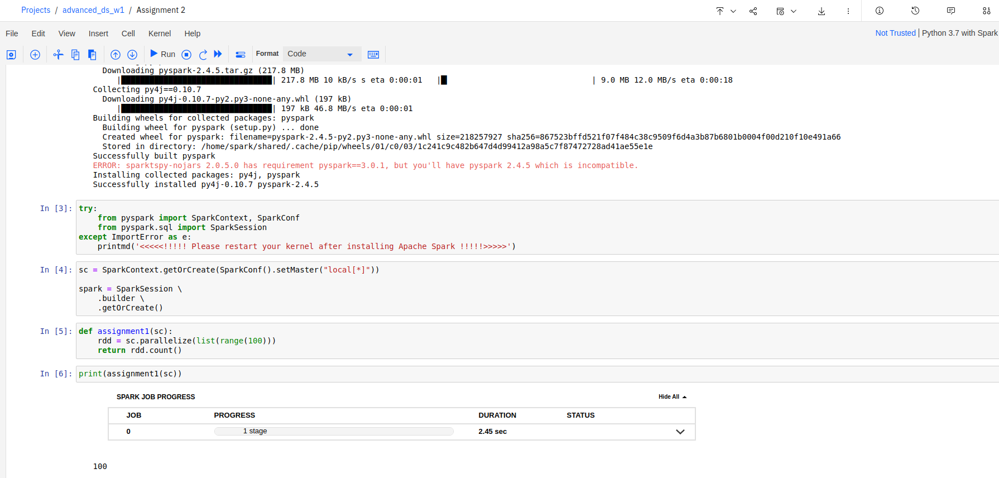

# __Course 1: Fundamentals of Scalable Data Science__

Course Link: [Fundamentals of Scalable Data Science](https://www.coursera.org/learn/ds)

## __Solution__

### __Week 1__
- Quiz:

    

- [Environment Setup](https://github.com/IBM/skillsnetwork/wiki/Watson-Studio-Setup) 

- [Programming assignment 1](./Assingment1.ipynb):

    

- [Programming assignment 2](./Assingment1.ipynb):

    

### __Week 2__
### __Week 3__
### __Week 4__

## Achievement goal:

## Contributors:
- 🐮 [@honghanhh](https://github.com/honghanhh)
- 🐔 [@tiena2cva](https://github.com/tiena2cva)
