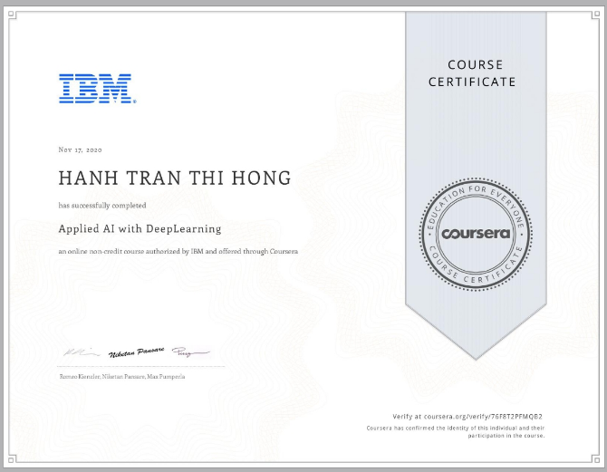
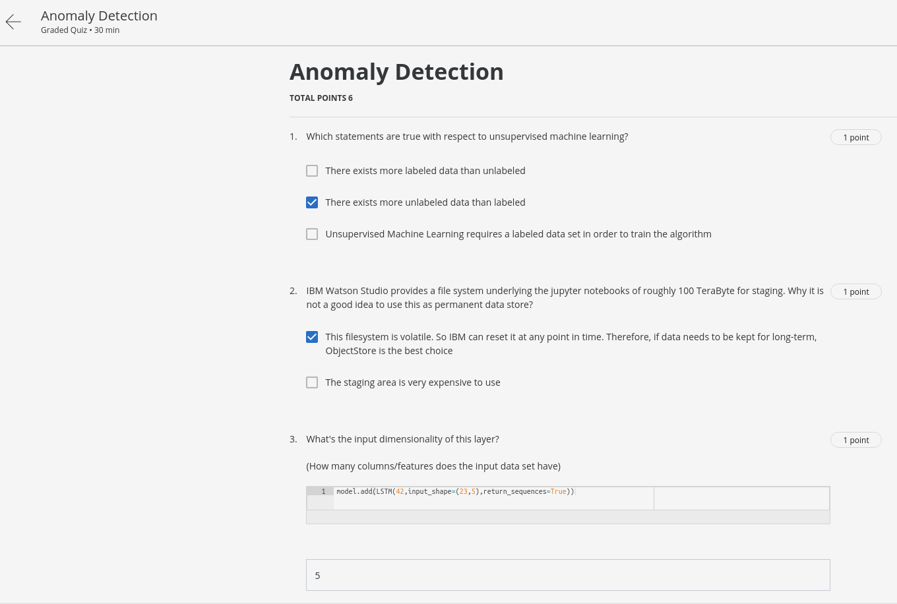
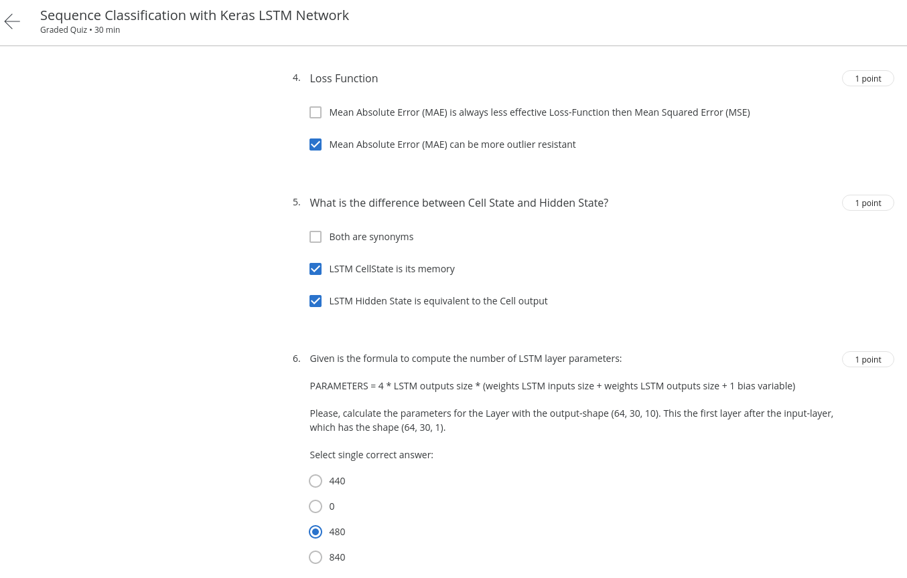

# Course 3: Advanced Data Science with IBM Specialization

**_Course Link_**: [Advanced Data Science with IBM Specialization](https://www.coursera.org/learn/ai)

## Achievement goal:

## Solution

### Week 1

- Quiz:
  
  

- [Assignment](https://github.com/GafBof/advanced_data_science_ibm/blob/main/Course%203:%20Applied%20AI%20with%20DeepLearning/Week%201/Assignment.ipynb).

### Week 2

- Quiz1:
  
  

- Quiz2:
  

- Quiz3:
  

- Quiz4:
  
  
  

- [Assignment](https://github.com/GafBof/advanced_data_science_ibm/blob/main/Course%203:%20Applied%20AI%20with%20DeepLearning/Week%202/Assignment.ipynb).

### Week 3

- Quiz1:
  
  

- Quiz2:
  
  

- Quiz3:
  

- Quiz4:
  

- [Assignment](https://github.com/GafBof/advanced_data_science_ibm/blob/main/Course%203:%20Applied%20AI%20with%20DeepLearning/Week%203/Assignment.ipynb).

### Week 4

- [Assignment](https://github.com/GafBof/advanced_data_science_ibm/blob/main/Course%203:%20Applied%20AI%20with%20DeepLearning/Week%204/Assignment.ipynb).

## Contributors:

- 🐮 [@honghanhh](https://github.com/honghanhh)
- 🐔 [@tiena2cva](https://github.com/tiena2cva)
