# Course 3: Advanced Data Science with IBM Specialization

**_Course Link_**: [Advanced Data Science with IBM Specialization](https://www.coursera.org/learn/ai)

## Achievement goal:

## Solution

### Week 1
- Quiz:
    

        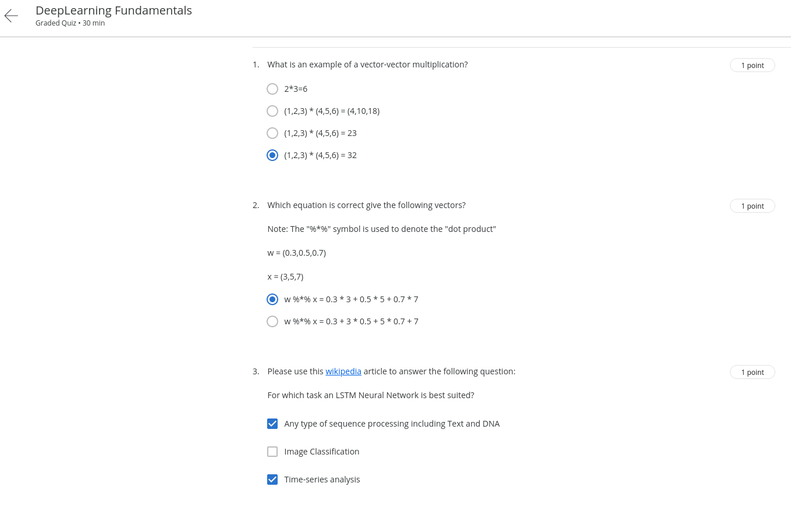
    

    

        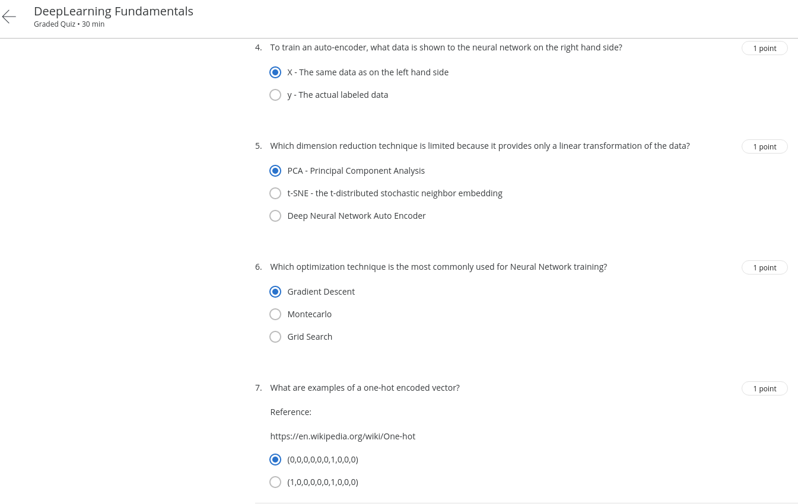
    

### Week 2

- Quiz1:
    

        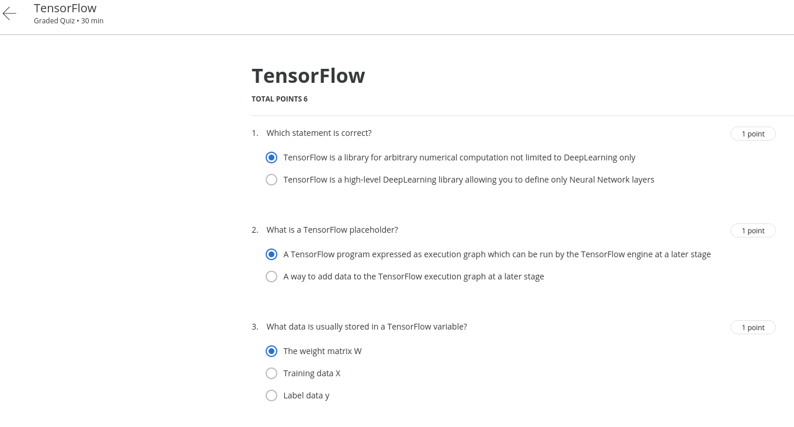
    

    

        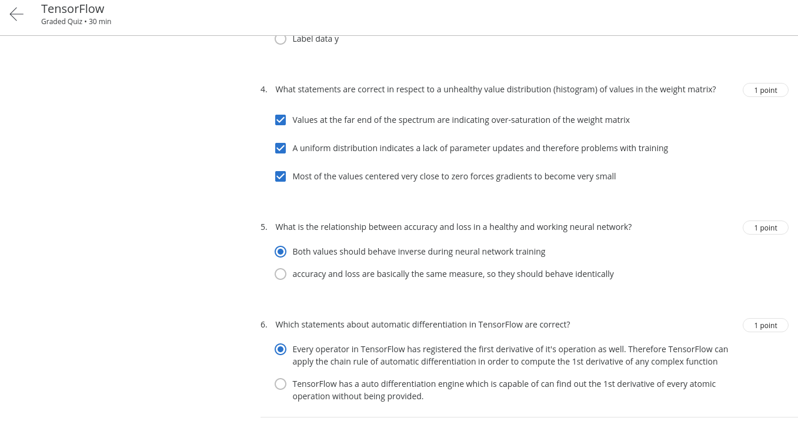
    

- Quiz2:
    

        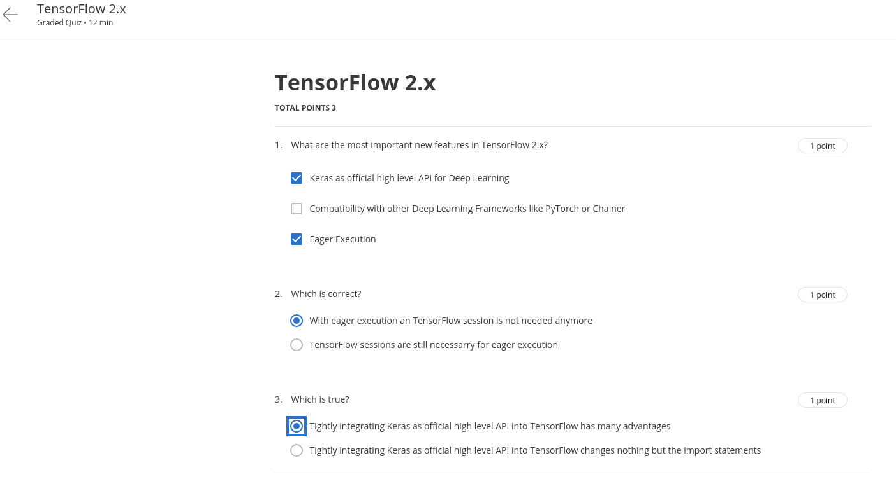
    

- Quiz3:
    

        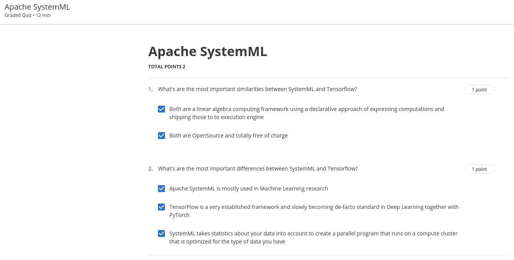
    

- Quiz4:
    

        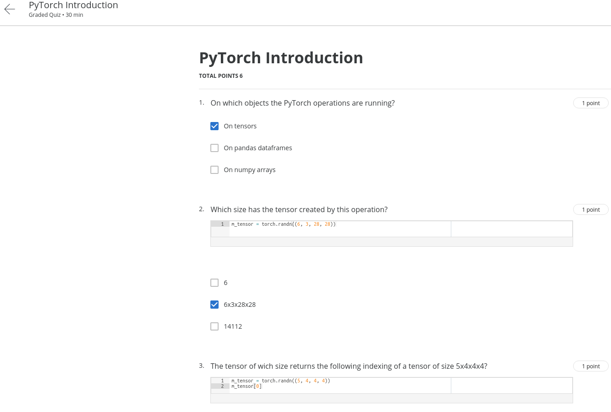
    

    

        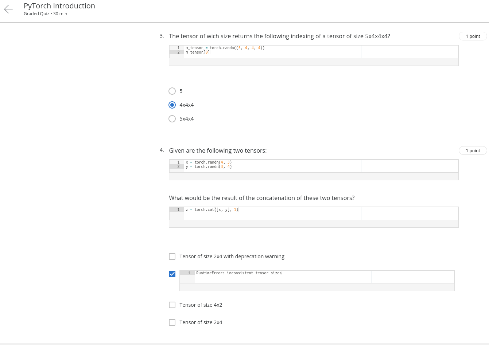
    

    

        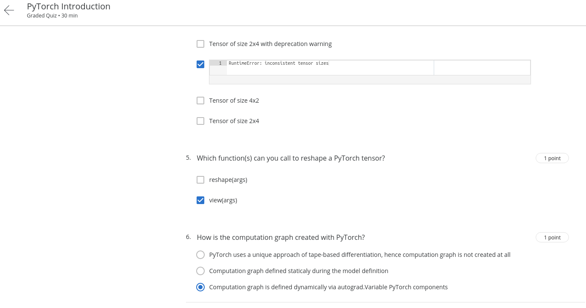
    

- [Assignment]().

### Week 3

- Quiz1:
    

        
    

    

        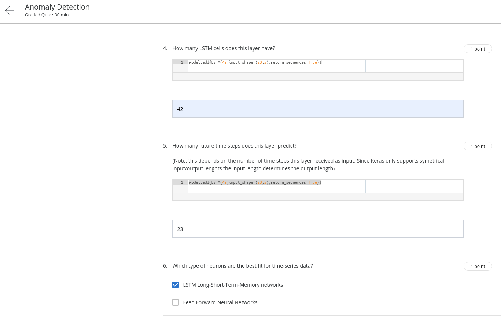
    

- Quiz2:
    

        
    

- Quiz3:
    

        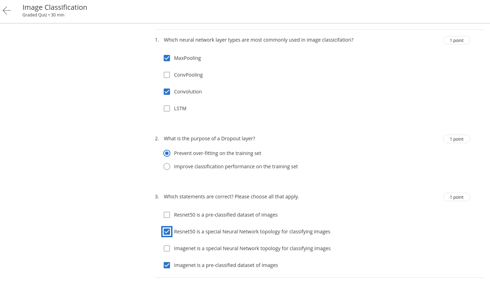
    

- Quiz4:
    

        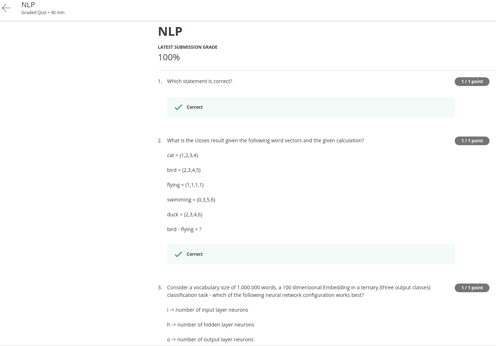
    

    

        
    

    

        
    

- [Assignment]().

### Week 4

- [Assignment]().

## Contributors:

- 🐮 [@honghanhh](https://github.com/honghanhh)
- 🐔 [@tiena2cva](https://github.com/tiena2cva)
